# Enhance Microsoft Teams with Private, Secure ChatGPT-like Functionality

Integrate a ChatGPT-like experience directly into Microsoft Teams, enabling users to ask any question directly within the platform. With all data and interactions securely contained within your private Power Platform environment and Azure Subscription, engage in confidential conversations using your business data, ensuring privacy and security at every step.
 

## Prerequesites

1. Power Platform 
    - Power Virtual Agent (PVA), to create the bot https://web.powerva.microsoft.com/
    - Power Automate Flows: https://make.powerautomate.com/
    - Recommended for productive use is separated DEV and PROD environments
    - Trial license: https://learn.microsoft.com/en-us/power-apps/maker/signup-for-powerapps
1. Azure Subscription
    - Azure Trial: https://azure.microsoft.com/en-us/free
1. Azure OpenAI Service   
    - Deployment Guide: https://learn.microsoft.com/en-us/azure/ai-services/openai/how-to/create-resource?pivots=web-portal
    - Request Access to OpenAI as described. Request only Text & code models.   
    

# Setup

## Deploy Azure OpenAI Service 

- Follow this documentation: https://learn.microsoft.com/en-us/azure/ai-services/openai/how-to/create-resource?pivots=web-portal   
- Once the OpenAI Service is deployed go to Models and deploy the gpt-35-turbo model.  
- Retrieve your endpoint URL and Key in "Chat Playground" -> "View code".

## Setup the Power Automate Flow (Flow)

- Login to: https://make.powerautomate.com/  
- Go to Solutions and import the Power Automate Flow.  
- Here you can download the flow as zip file: [Download the Power Automate Flow](https://github.com/mimergel/Azure_OpenAi_Chat_in_Teams/raw/main/flow/Ask_me_anything_flow_export_1_0_0_4.zip)  

    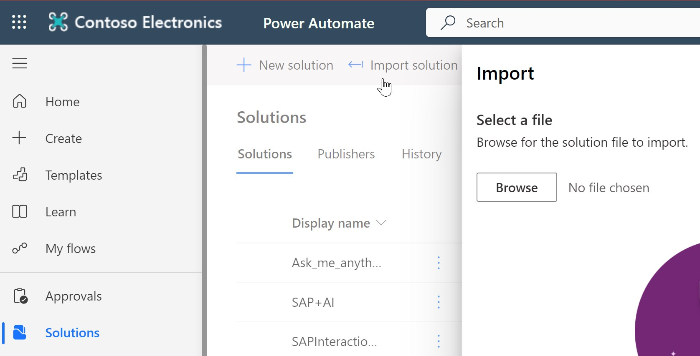  

- "Turn on" the flow.  
- In case you're insterested to understand each step in the flow: [Description of the Flow](flow/README.md)

## Change URI and KEY in HTTP Connector of the Flow

- Get your Azure OpenAI URL and API-Key from the Azure Open AI Service Chat playground.  

      

- URI example: https://[your endpoint].openai.azure.com/openai/deployments/chat/chat/completions?api-version=2023-07-01-preview
- Enter the URI and KEY in the respective fields of the HTTP Connector.  

    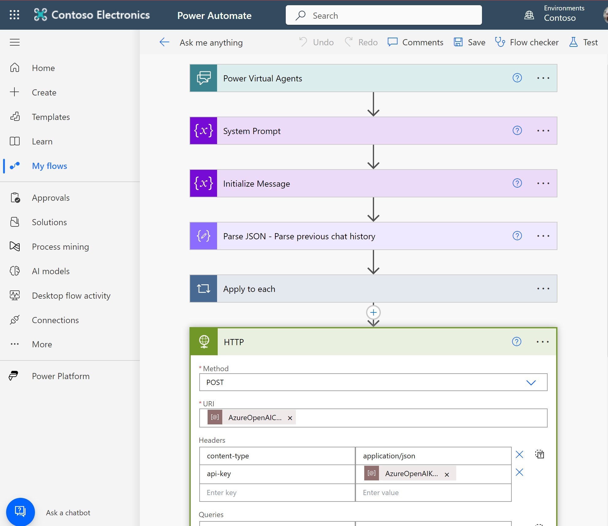  

- For now you can enter this directly in clear text. For later production use it's recommended to configure these as secrets and put references to the secrets like seen in the screen shot.  

## Setup the Power Virtual Agent (PVA)

- Login to: https://web.powerva.microsoft.com/ and create a new bot.  

    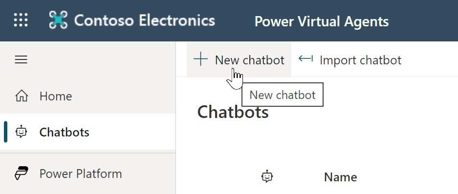  

    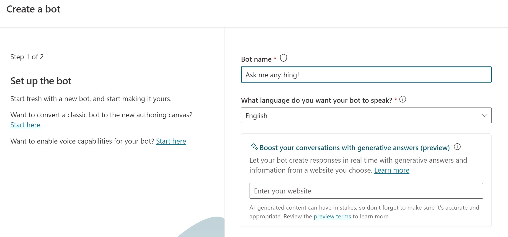  
     

- In the fallback topic paste the code from the provided fallback.yaml file.  
- Download the fallback topic code here: [fallback.yaml](pva/fallback.yaml)  
     

    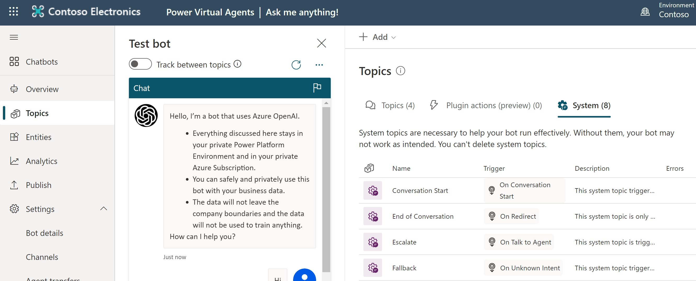  
     

    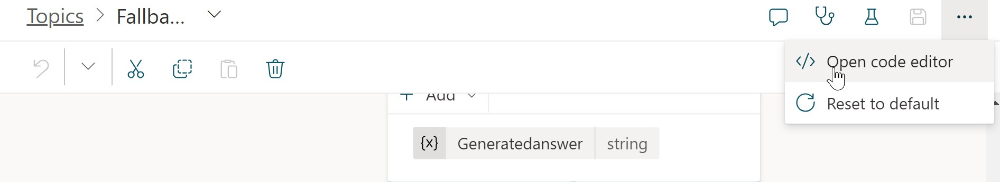  

- Open the code editor and enter the code via copy/paste.   
- The last step is to configure your personal bot greeting message into the following 2 topics: 
    - Conversation Start
    - Reset Conversation  
     

## Test & Publish the Bot

- Test the Bot:  

    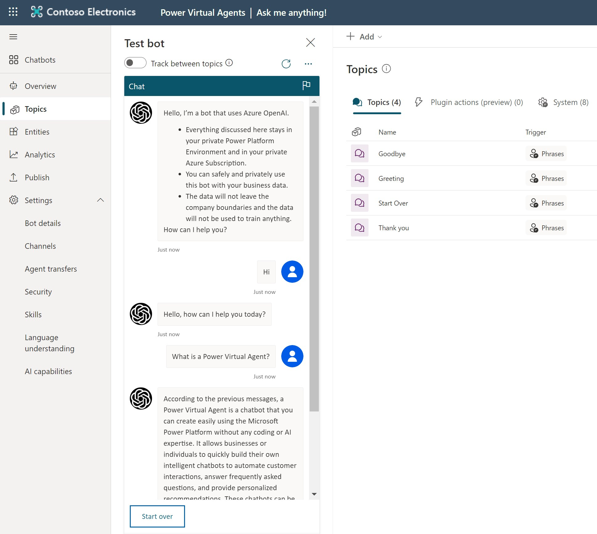  

- When OK publish the bot:  

    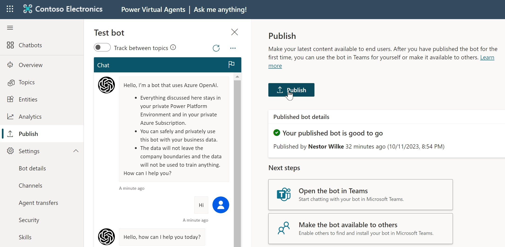  

- Open the Bot in Teams and test:  

    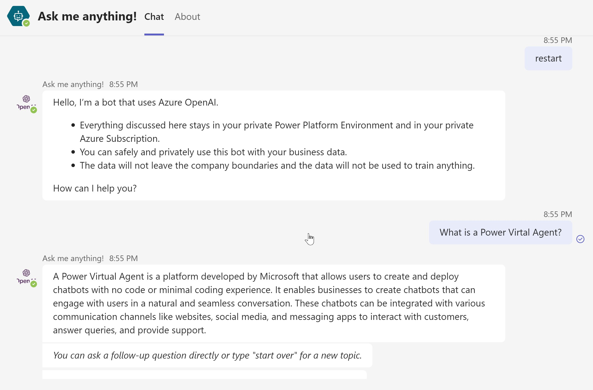  

## Troubleshooting

- In case of errors most likely the flow failed.    
    - Check here: https://make.powerautomate.com/ in  
        - "My Flows"    
        - "28-days run history"   
- The logs of the flow run provide helpful error messages.   

    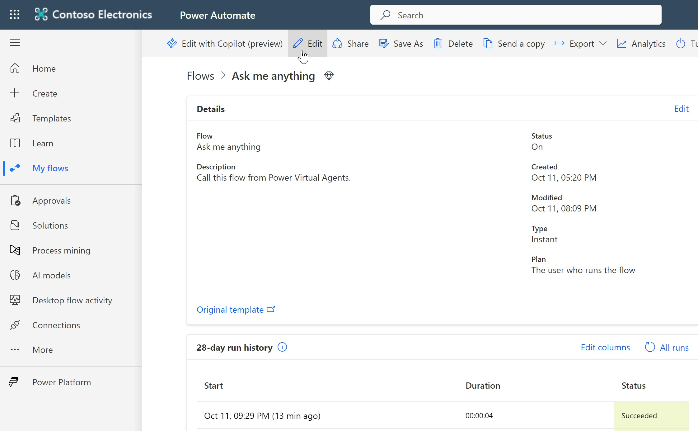  

    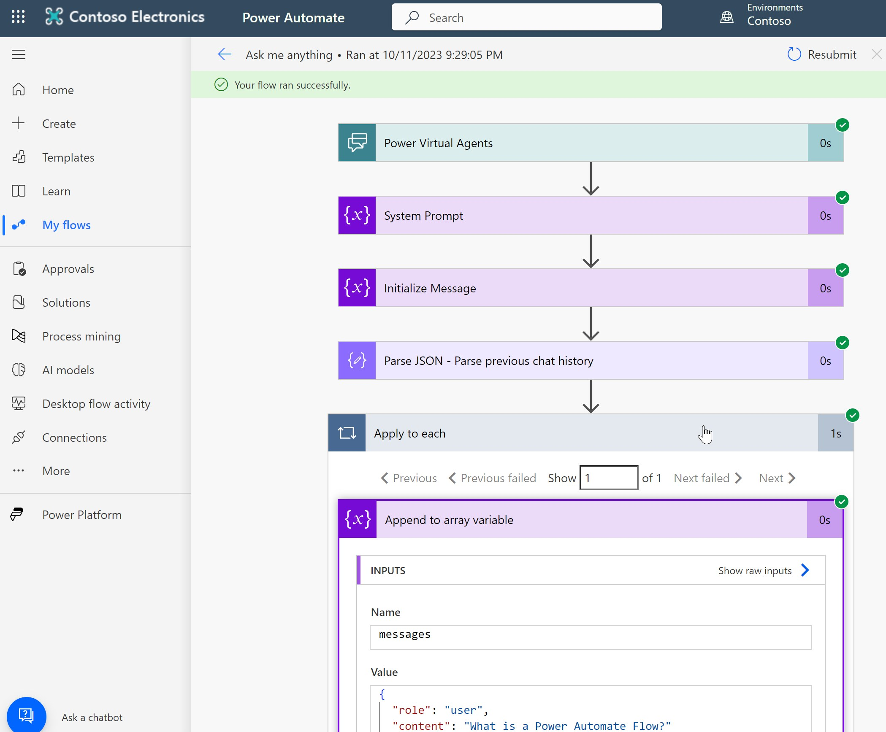  

## Disclaimer
THE CONTENT OF THIS REPOSITORY IS PROVIDED AS IS WITHOUT WARRANTY OF ANY KIND, EITHER EXPRESS OR IMPLIED, INCLUDING ANY IMPLIED WARRANTIES OF FITNESS FOR A PARTICULAR PURPOSE, MERCHANTABILITY, OR NON-INFRINGEMENT.
