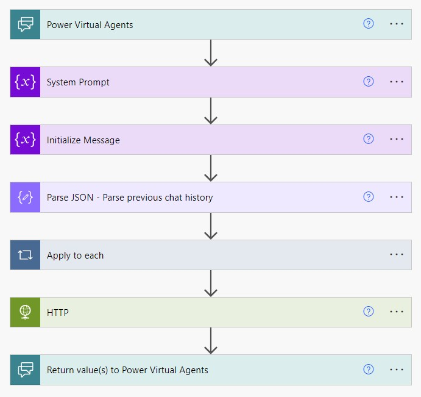

# Flow Background Information 

 <br>

## Inputs
The Flow receives inputs from the PVA:

1. UnrecognizedTriggerPhrase *(the latest message, (triggerBody()['text']))*
1. FullDialog *(triggerBody()['text_1'])*

## Variables

**System Prompt**
Type: String
> You are an AI assistant that helps people find information. <br>
> You have to read the enitre coversation so far and answer to the last message with all the context in mind. *

**Message**
Type: Array
```
[
  {
    "role": "system",
    "content": "@{variables('System Prompt')}"
  }
]
```

## Parse JSON
Concatenate the chat history with the last message and parse the JSON format to assign each step of the conversation to the message array. <br>

**Parse_JSON_Previous_Chat_History**
```
json(
  concat(
    '[',
    triggerBody()['text_1'],
    '{"role": "user","content": "', 
    triggerBody()['text'], 
    '" }]'
  )
)
```

**Schema**
```
{
    "type": "array",
    "items": {
        "type": "object",
        "properties": {
            "role": {
                "type": "string"
            },
            "content": {
                "type": "string"
            }
        },
        "required": [
            "role",
            "content"
        ]
    }
}
```

## Apply to each

The apply to each step build the message array that contains the whole conversation.

**Input**
```
body('Parse_JSON_-_Parse_previous_chat_history')
```

**Append to array variable**

Variable Name: messages
Value: Apply to each "Current item"

## HTTP Post

The Body contains the messages array:

```
{
  "messages": @{variables('Messages')}
}
```

Example HTTP Post message body after 4 interactions:

```
"messages": [
    {
        "role": "system",
        "content": "You are an AI assistant that helps people find information\nYou have to read the enitre coversation so far and answer to the last message with all the context in mind."
    },
    {
        "role": "user",
        "content": "What time is it now?"
    },
    {
        "role": "assistant",
        "content": "I apologize, but as an AI assistant, I don't have access to real-time information such as the current time. Please refer to a device or application that displays the current time, such as your phone, computer, or a wall clock."
    },
    {
        "role": "user",
        "content": "If I provide you the current data and time, can you then work with it and for example calculate the UTC time in 2 days and 6 hours?"
    },
    {
        "role": "assistant",
        "content": "Yes, if you provide me with the current date and time, I can work with that information to calculate the UTC time in the future. Please provide the current date and time so that I can assist you further."
    },
    {
        "role": "user",
        "content": "It is now the 16. October 2023 12:23 PM. Please tell me the date and time in 49 hours and 45 minutes?"
    }
]

```

## Return values to PVA

The last answer and the full conversation are sent back to the power virtual agent:

**Generatedanswer**

```
body('HTTP')?['choices'][0]?['message']?['content']
```

**OriginalUnrecognizedTriggerPhrase**

```
triggerBody()['text_1']
```

